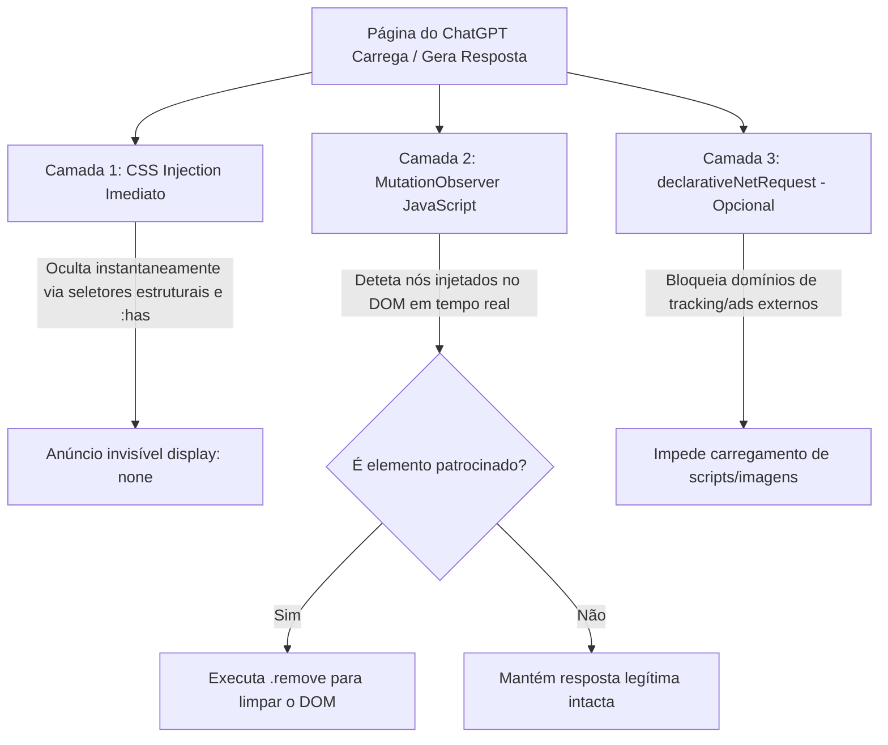

# Guia Completo & Análise Técnica: Como Funcionam e Como Bloquear Anúncios no ChatGPT

Este documento reúne a análise técnica aprofundada sobre a infraestrutura de anúncios da OpenAI no ChatGPT (`ads.openai.com`), o comportamento visual e estrutural no DOM, e o plano arquitetural para criar uma extensão de bloqueio eficaz, leve e resiliente a atualizações da interface.

---

## 1. Análise Aprofundada: Como Funcionam os Anúncios no ChatGPT

### 1.1. Onde e Como Aparecem
* **Posicionamento:** Os anúncios **não são inseridos no meio do texto** da resposta gerada pela IA. Eles aparecem sempre **no final/abaixo da resposta**, como um bloco ou card visual separado dentro do fluxo da conversa.
* **Aparência Visual:** Surgem como caixas destacadas (*tinted cards* ou cartões com fundo subtilmente diferente), com imagem, título, descrição curta, preço/avaliação (no caso de e-commerce) e um botão de ação com link externo.
* **Rotulagem Obrigatória:** Por questões legais e de transparência, a OpenAI é obrigada a identificar claramente o conteúdo patrocinado com tags como `"Sponsored"`, `"Patrocinado"`, `"Ad"` ou através de atributos de acessibilidade (`aria-label="Sponsored"` / `aria-label="Patrocinado"`).

### 1.2. Infraestrutura e Segmentação
* **Motor de Anúncios:** A OpenAI opera a plataforma em parceria com a infraestrutura do **Microsoft Advertising** (`ads.openai.com`).
* **Targeting Contextual (*Context Hints*):** Em vez de palavras-chave estáticas tradicionais, o sistema analisa a intenção da conversa em tempo real para exibir anúncios contextuais (ex: planeamento de viagens, procura de produtos, recomendações de software).
* **Independência do Modelo:** A OpenAI afirma que os anúncios não enviesam a resposta do modelo; o anúncio é renderizado como um payload/elemento adjacente à resposta principal.

### 1.3. Planos Afetados vs. Isentos
* **Com Anúncios:** Utilizadores no plano **Free (Gratuito)** e no plano de entrada **ChatGPT Go**.
* **Sem Anúncios:** Utilizadores com assinaturas **Plus, Pro, Business, Enterprise e Edu**.
* **Restrições Éticas:** Anúncios são desativados para menores de 18 anos, em conversas temporárias e em tópicos sensíveis (saúde mental, política, etc.).

---

## 2. Desafios Técnicos do ChatGPT (Por que bloqueadores genéricos falham)

1. **Classes CSS Ofuscadas/Dinâmicas:** O ChatGPT utiliza classes geradas por compiladores (estilo Tailwind/CSS Modules com hashes que mudam com frequência). Não se deve depender de nomes de classes estáticas como `.ad-container-123`.
2. **Renderização Dinâmica em Streaming (SSE / WebSockets):** A interface atualiza o DOM em tempo real à medida que o texto é gerado. O bloco de anúncio pode ser injetado alguns milissegundos após o término da resposta de texto.
3. **Risco de Falsos Positivos:** Se um utilizador perguntar *"O que significa a palavra 'Sponsored'?"*, o script não pode apagar a resposta legítima do ChatGPT por conter essa palavra. A deteção precisa ser estrutural e contextual.

---

## 3. Estratégia de Bloqueio em 3 Camadas

Para garantir **zero visualização** e **zero quebras no chat**, usamos uma abordagem combinada:



### Camada 1: Ocultação Imediata via CSS (`styles.css`)
O CSS roda antes de qualquer JavaScript terminar de executar, garantindo que o utilizador nunca vê o anúncio "piscar" na tela:
* Seleciona elementos com atributos `data-testid` relacionados a `ad` ou `sponsored`.
* Utiliza a pseudo-classe moderna `:has()` para identificar caixas que contenham tags/textos de patrocínio.
* Aplica `display: none !important; height: 0 !important; visibility: hidden !important; pointer-events: none !important;`.

### Camada 2: Varredura Dinâmica e Remoção Física (`content.js`)
* Um `MutationObserver` monitoriza a árvore do DOM (`childList` e `subtree`).
* Inspeciona blocos que surgem após as mensagens da IA (turnos de conversa `article` ou divisões de mensagem).
* Localiza elementos que contenham rótulos de anúncio estruturados ou botões de patrocínio.
* Aplica o método `.remove()` no nó container do anúncio, eliminando-o fisicamente do DOM e evitando espaços em branco ou anomalias no scroll.

### Camada 3: Fail-Safes de Proteção à Conversa
* **Verificação de profundidade e tamanho:** O script apenas remove elementos pequenos/containers de anúncio secundários, nunca a tag principal de turno da conversa (`article` / `[data-testid^="conversation-turn-"]` ou o nó de markdown principal da resposta).

---

## 4. Estrutura Modular da Extensão (Manifest V3)

A extensão é construída sem frameworks pesados, mantendo 100% de compatibilidade e aprovação rápida na Chrome Web Store:

```
📁 anti-chatgpt-ads/
├── 📄 manifest.json        # Configurações Manifest V3 e permissões mínimas
├── 📄 styles.css           # Regras CSS para ocultação instantânea
├── 📄 content.js           # MutationObserver inteligente para remoção no DOM
├── 📄 popup.html           # Interface visual ao clicar no ícone
├── 📄 popup.css            # Estilos dark-mode premium para o popup
├── 📄 popup.js             # Lógica do toggle Ligar/Desligar e estatísticas de bloqueio
├── 🖼️ logo.png             # Logótipo do produto (200x200 px)
├── 🖼️ icon16.png           # Ícone 16x16 px (Barra do browser)
├── 🖼️ icon48.png           # Ícone 48x48 px (Gestor de extensões)
└── 🖼️ icon128.png          # Ícone 128x128 px (Chrome Web Store)
```

---

## 5. Estratégia de Monetização do Produto

Como o bloqueador principal será 100% gratuito para maximizar a adoção:

1. **Botão de Doações / Gorjetas (Popup):**
   * Link direto para *Buy Me a Coffee* ou *Ko-fi* integrado na interface do popup.
2. **Recomendações / Afiliados de IA:**
   * Uma secção discreta no popup: *"Ferramentas de IA recomendadas"* com links de parceiros (ferramentas de produtividade, automação, transcrição).
3. **Módulo Freemium Futuro:**
   * A extensão base limpa os anúncios.
   * Versão Pro desbloqueia ferramentas de produtividade:
     * Biblioteca e organizador de Prompts no ChatGPT.
     * Pastas para organizar conversas na barra lateral.
     * Exportação do chat em PDF limpo, Markdown ou Notion.
4. **Captação de Leads / Divulgação Cruzada:**
   * Utilizar a base de utilizadores da extensão para promover novos projetos e produtos digitais.

---

## 6. Checklist de Publicação na Chrome Web Store

- [ ] Criar conta no [Chrome Web Store Developer Console](https://chrome.google.com/webstore/devconsole) (taxa única de $5 USD).
- [ ] Gerar os ícones nos 3 tamanhos (`16x16`, `48x48`, `128x128`).
- [ ] Criar 1 a 2 screenshots promocionais (resolução `1280x800` ou `640x400`).
- [ ] Compactar a pasta num ficheiro `.zip` e fazer upload.
- [ ] Preencher título, descrição concisa e política de privacidade básica (declarando que nenhum dado do utilizador é recolhido).
